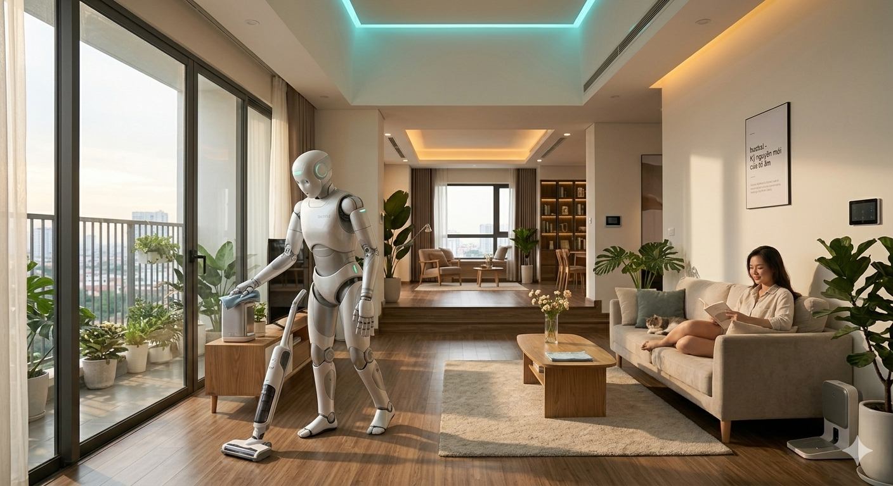

# BushXI_Clean_Robot 🤖🧹



An independent, open-source Humanoid Cleaning Robot project focusing on clean-room mechanics, Vision-Language-Action (VLA) task planning, and dynamic obstacle avoidance.

## 🌟 Key Features
- **Cognitive Layer:** Powered by LLaVA (via Ollama) and Faster-Whisper for multi-modal voice command understanding (e.g., "Clean up recyclable bottles").
- **Perception System:** Real-time object detection and 3D coordinate estimation using YOLOv8 and Depth Camera stream.
- **Locomotion & Safety:** Safe motion generation using Riemannian Motion Policies (RMPflow) to dynamically evade moving obstacles in real-time.
- **Clean Architecture:** 100% original graphics and proprietary code framework, legally free from corporate copyrights.

## 📂 Project Structure
```text
BushXI_Clean_Robot/
├── config/             # Robot descriptions and configs
├── src/                # Core Python source code
│   ├── brain.py        # LLaVA Cognitive & Voice processing
│   ├── vision.py       # YOLOv8 Camera perception
│   └── control.py      # IK and RMPflow motor controller
├── tests/              # Isaac Sim test scripts
├── README.md           # Project documentation
├── requirements.txt    # Python dependencies
└── .gitignore          # Git exclusion file
```

## 🛠️ Quick Start
1. Install [Ollama](https://ollama.com) and pull the LLaVA model:
   ```bash
   ollama run llava
   ```
2. Install Python dependencies:
   ```bash
   pip install -r requirements.txt
   ```
3. Run the integrated AI simulation:
   ```bash
   python src/brain.py
   ```

## 🗺️ Project Roadmap

Our development strategy is divided into 4 clear phases, moving from pure physics simulation to a production-ready physical humanoid.

### 📅 Phase 1: Mind & Sight (Q1 - Q2 2026) -> [CURRENT]
- [x] Integrate **Faster-Whisper** for offline Vietnamese voice commands.
- [x] Connect **LLaVA (via Ollama)** for multi-modal context understanding.
- [x] Implement **YOLOv8** pipeline for 2D object localization in simulation.
- [ ] Connect 2D bounding boxes with Isaac Sim **Depth Map** for 3D coordinate mapping.

### 🏃 Phase 2: Locomotion & Simulation (Q3 - Q4 2026)
- [ ] Configure **Isaac Lab** parallel environments (1024+ cloned robots).
- [ ] Train walking balance policies using **PPO (Proximal Policy Optimization)**.
- [ ] Implement **RMPflow** for real-time dynamic obstacle avoidance.
- [ ] Perform end-to-end simulation tests (Voice Command -> Path Planning -> Grasping -> Lifting).

### 🔩 Phase 3: The Physical Prototype (Q1 - Q2 2027)
- [ ] Release open-source **CAD files** (`/hardware`) for 3D-printable structural joints (PA-CF/PETG).
- [ ] Establish low-level MCU communication protocols via **CAN-Bus** (Teensy 4.1/STM32).
- [ ] Assemble a mid-scale (1.2m) physical prototype running on **NVIDIA Jetson AGX Orin**.
- [ ] Execute **Sim-to-Real (S2R)** policy transfer for physical walking and grasping.

### 🚀 Phase 4: Production & Ecosystem (Q3 - Q4 2027)
- [ ] Optimize the embedded VLM network (e.g., LLaVA-Phi3) using **NVIDIA TensorRT** for sub-10ms latency.
- [ ] Open the **BushXI Plugin Store** for third-party custom cleaning behaviors (e.g., mopping, ironing).
- [ ] Launch a crowdfunding campaign for the **BushXI Developer Kit**.

---

## 🤝 How to Contribute

We love open-source contributions! Whether you are an AI researcher, a mechanical engineer, or a control theory expert, you can help us:
1. **Fork** the repository.
2. Create your feature branch (`git checkout -b feature/AmazingFeature`).
3. **Commit** your changes (`git commit -m 'Add some AmazingFeature'`).
4. **Push** to the branch (`git push origin feature/AmazingFeature`).
5. Open a **Pull Request**.

Check our `ISSUES` tab for current bugs and feature requests!


## ⚖️ License
This project is licensed under the MIT License - see the LICENSE file for details.
Copyright (c) 2026 bushxi.
